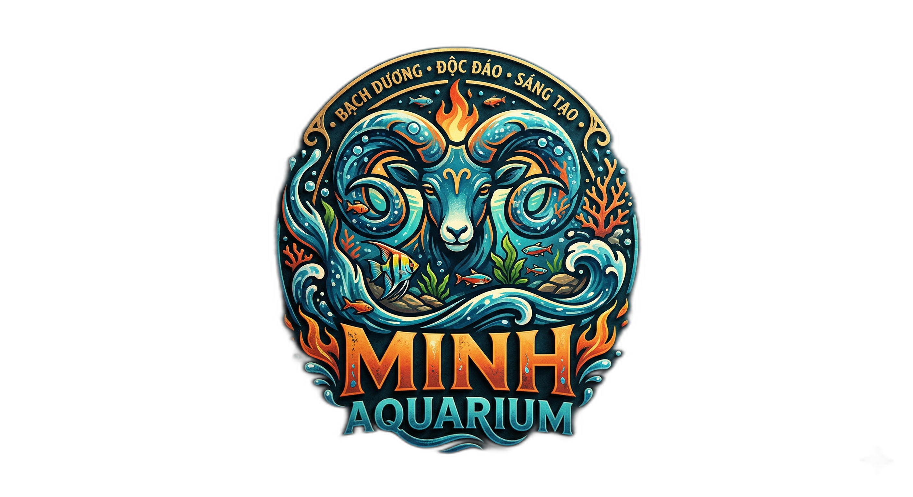

# 🐠 Minh Aquarium — Nền Tảng Thương Mại Điện Tử & Dịch Vụ Thủy Sinh

<div align="center">



[](https://nodejs.org/)
[](https://expressjs.com/)
[](https://vitejs.dev/)
[](https://vuejs.org/)
[](https://www.mysql.com/)
[](https://www.docker.com/)
[](https://firebase.google.com/)
[](https://ai.google.dev/)
[](https://playwright.dev/)

**Hệ thống website thương mại điện tử chuyên nghiệp cung cấp cá cảnh, tép cảnh, cây thủy sinh, thiết bị hồ cá cao cấp, dịch vụ thiết kế setup bể trọn gói và trợ lý ảo AI tư vấn 24/7.**

[Tính năng](#-tính-năng-nổi-bật) • [Cấu trúc dự án](#-cấu-trúc-thư-mục) • [Công nghệ](#-công-nghệ-sử-dụng) • [Hướng dẫn cài đặt](#-hướng-dẫn-cài-đặt--chạy-dự-án) • [API & Chatbot](#-ai-chatbot--api) • [Testing](#-kiểm-thử-e2e)

</div>

---

## 🌟 Tính Năng Nổi Bật

- 🌿 **Trưng bày sản phẩm đa dạng:** Cá cảnh, tép cảnh phong phú, cây thủy sinh, phân nền, máy lọc thác/thùng, đèn LED WRGB chuyên dụng.
- 🔍 **Bộ lọc thông minh:** Lọc theo từng danh mục sinh vật, thiết bị, khoảng giá và tìm kiếm từ khóa tức thì.
- 🛒 **Giỏ hàng & Đặt hàng tiện lợi:** Quản lý số lượng thời gian thực, lưu trữ qua LocalStorage, hỗ trợ tính phí ship và giao hỏa tốc cho cá sống.
- 🛠️ **Dịch vụ Setup Bể theo yêu cầu:** Tiếp nhận yêu cầu tư vấn kích thước bể, phong cách cảnh quan (Iwagumi, Biotope, Hà Lan, Rừng nhiệt đới).
- 🤖 **Trợ lý AI Gemini thông minh:** Chatbot tư vấn trực tiếp trên website dựa trên kiến thức thủy sinh thực tế (RAG) và hỗ trợ kết nối nhân viên tư vấn.
- 🔐 **Xác thực người dùng:** Đăng ký, đăng nhập an toàn với Firebase Authentication.
- 🐳 **Đóng gói Docker toàn diện:** Sẵn sàng triển khai nhanh chóng với Docker Compose (API Node.js + CSDL MySQL).
- 🧪 **Kiểm thử tự động E2E:** Bộ test Playwright kiểm tra luồng mua hàng, đăng nhập và tìm kiếm sản phẩm.

---

## 📂 Cấu Trúc Thư Mục

```text
Minh-Aquarium/
├── 📁 src/                       # Ứng dụng Frontend chính (Vite Multi-page)
│   ├── 📁 assets/
│   │   ├── 📁 css/              # Stylesheet hệ thống (style.css)
│   │   ├── 📁 js/               # Logic giao diện, giỏ hàng, Chatbot, Firebase
│   │   └── 📁 images/anh/       # Thư viện ảnh sản phẩm, banner, logo
│   ├── index.html               # Trang chủ
│   ├── products.html            # Trang danh mục & chi tiết sản phẩm
│   ├── cart.html                # Trang giỏ hàng & thanh toán
│   ├── login.html               # Trang đăng nhập / đăng ký (Firebase Auth)
│   ├── blog.html                # Trang chia sẻ kiến thức thủy sinh
│   └── services.html            # Trang dịch vụ thiết kế setup hồ cá
│
├── 📁 frontend/                  # Phiên bản SPA hiện đại xây dựng bằng Vue 3 + Vite
│   ├── 📁 src/
│   │   ├── 📁 components/       # Header, Footer, ChatWidget, ProductCard...
│   │   ├── 📁 pages/            # HomePage, ProductsPage, CartPage...
│   │   ├── 📁 composables/      # Quản lý state giỏ hàng (useCart)
│   │   └── 📁 data/             # Mock data & cấu hình
│   └── vite.config.js           # Cấu hình Vite cho Vue 3
│
├── 📁 server/                    # Backend Node.js & Express
│   ├── 📁 db/
│   │   └── database.sql         # Schema khởi tạo database MySQL
│   └── server.js                # API RESTful, tích hợp Gemini AI & MySQL
│
├── 📁 scripts/                   # Bộ script bảo trì & tiện ích
│   ├── seed_database_from_products.js  # Tự động trích xuất sản phẩm từ HTML vào DB
│   └── run_playwright.js        # Script chạy test Playwright E2E
│
├── 📁 tools/                     # Công cụ tiện ích dòng lệnh (CLI Chatbot)
│   └── chatbot.py               # Thử nghiệm chatbot Gemini qua Terminal
│
├── 📁 docs/                      # Tài liệu dự án
│   ├── FEATURES.md              # Bảng đặc tả chi tiết toàn bộ tính năng
│   └── nd.text                  # Ngữ cảnh tri thức cho trợ lý ảo RAG
│
├── 📁 tests/                     # Kiểm thử tự động (E2E Tests)
│   └── 📁 e2e/                  # Test suites: cart, login, products, smoke
│
├── .env.example                 # Mẫu cấu hình biến môi trường
├── .dockerignore                # Cấu hình loại trừ cho Docker
├── .gitignore                   # Cấu hình loại trừ cho Git
├── Dockerfile                   # Dockerfile cho backend API
├── docker-compose.yml           # Khởi chạy fullstack (API + MySQL)
├── package.json                 # Quản lý thư viện và scripts dự án
├── playwright.config.js         # Cấu hình Playwright test runner
└── vite.config.js               # Cấu hình Vite root
```

---

## 💻 Công Nghệ Sử Dụng

| Tầng | Công nghệ | Chi tiết |
| :--- | :--- | :--- |
| **Frontend** | HTML5, CSS3, JavaScript (ES6+), Vite | Giao diện responsive, tối ưu tốc độ tải trang |
| **Vue 3 SPA** | Vue 3, Vue Router, VueUse | Bản nâng cấp Single Page Application mượt mà |
| **Backend** | Node.js, Express.js | RESTful API, rate-limiting, CORS, static serving |
| **Database** | MySQL 8.0, mysql2 | Lưu trữ thông tin sản phẩm, đơn hàng, danh mục |
| **Authentication** | Firebase Auth (Client & Admin SDK) | Xác thực danh tính người dùng an toàn |
| **AI Assistant** | Google Generative AI (Gemini 1.5 Flash) | Tư vấn khách hàng thông minh kết hợp dữ liệu cửa hàng |
| **DevOps** | Docker, Docker Compose | Môi trường triển khai đồng nhất, nhẹ và nhanh |
| **Testing** | Playwright Test | Kiểm thử tự động E2E cho giao diện và luồng thanh toán |

---

## 🚀 Hướng Dẫn Cài Đặt & Chạy Dự Án

### 1. Yêu cầu tiên quyết
- **Node.js**: Phiên bản 18+ trở lên
- **Docker & Docker Compose** (Tùy chọn, khuyến nghị nếu muốn chạy trọn gói kèm MySQL)
- **Python 3.9+** (Nếu muốn chạy công cụ CLI chatbot trong `tools/`)

### 2. Thiết lập môi trường

Sao chép file mẫu `.env.example` thành `.env`:

```bash
cp .env.example .env
```

Cập nhật thông tin trong file `.env`:
```env
DB_HOST=localhost
DB_PORT=3307
DB_USER=minh_user
DB_PASSWORD=minh123
DB_NAME=minh_aquarium
PORT=3000
GEMINI_API_KEY=your_gemini_api_key_here
GEMINI_MODEL=gemini-1.5-flash
ENABLE_GEMINI=true
```

---

### 3. Cách 1: Chạy trọn gói với Docker Compose (Khuyến nghị)

Khởi động hệ thống API Backend và MySQL Database:

```bash
docker compose up -d --build
```

- **Website / API Backend:** `http://localhost:3000`
- **Cơ sở dữ liệu MySQL:** `localhost:3307`

Kiểm tra trạng thái container:
```bash
docker compose ps
docker compose logs -f api
```

Dừng hệ sinh thái container:
```bash
docker compose down
```

---

### 4. Cách 2: Chạy trực tiếp trên máy cục bộ (Local Development)

#### Bước 1: Cài đặt thư viện
```bash
npm install
```

#### Bước 2: Khởi động máy chủ phát triển Frontend (Vite)
```bash
npm run dev
```
Website phát triển sẽ mở tại `http://localhost:5173` (tự động proxy các request `/api` sang backend `http://localhost:3000`).

#### Bước 3: Khởi động máy chủ Backend (Node.js/Express)
Mở một terminal mới:
```bash
npm run start
```
API server lắng nghe tại `http://localhost:3000`.

---

### 5. Cách 3: Chạy ứng dụng Vue 3 (Thư mục `frontend/`)

Dự án có sẵn phiên bản Vue 3 SPA hiện đại:

```bash
# Cài đặt dependencies cho Vue frontend
cd frontend && npm install && cd ..

# Chạy dev server cho Vue frontend từ root
npm run frontend:dev

# Hoặc build production bundle cho Vue
npm run frontend:build
```
Ứng dụng Vue 3 chạy tại `http://localhost:5173`.

---

## 🗄️ Khởi Tạo Dữ Liệu Sản Phẩm (Database Seed)

Khi CSDL MySQL đang chạy, nạp danh mục và toàn bộ sản phẩm thực tế vào database:

```bash
npm run seed:db
```

---

## 🤖 AI Chatbot & API

- **Web Chatbot:** Nút chat nổi góc dưới màn hình kết nối trực tiếp với backend Gemini AI tại `/api/chat`. Chatbot trả lời dựa trên kho tri thức thủy sinh `docs/nd.text` và danh sách sản phẩm trong database.
- **Thử nghiệm nhanh qua CLI:**
  ```bash
  npm run chatbot:cli "Tư vấn cách setup bể cá 60cm cho người mới"
  ```

---

## 🧪 Kiểm Thử E2E (Playwright)

Chạy toàn bộ bộ kiểm thử tự động End-to-End:

```bash
npm run test:e2e
```

Chạy kiểm thử với dev server tự khởi động:
```bash
# PowerShell
$env:PLAYWRIGHT_START_WEBSERVER="1"; $env:PLAYWRIGHT_BASE_URL="http://127.0.0.1:4173"; npm run test:e2e
```

---

## 📜 Danh Sách Lệnh (NPM Scripts)

| Lệnh | Ý nghĩa |
| :--- | :--- |
| `npm run dev` | Bật Vite Dev Server cho giao diện chính (`http://localhost:5173`) |
| `npm run build` | Đóng gói production bundle cho trang tĩnh vào thư mục `dist/` |
| `npm run preview` | Xem trước production build của Vite |
| `npm run start` | Khởi động máy chủ Backend Express (`http://localhost:3000`) |
| `npm run frontend:dev` | Bật Dev Server cho ứng dụng Vue 3 SPA |
| `npm run frontend:build` | Build production cho ứng dụng Vue 3 SPA |
| `npm run seed:db` | Đồng bộ dữ liệu sản phẩm từ HTML vào MySQL |
| `npm run test:e2e` | Chạy bộ kiểm thử tự động Playwright |
| `npm run chatbot:cli` | Chạy chatbot tư vấn bằng giao diện dòng lệnh Python |

---

## 👨‍💻 Tác Giả & Đóng Góp

- **Dự án:** [Minh-Aquarium](https://github.com/DevMarkie/Minh-Aquarium)
- **Tác giả:** DevMarkie
- **Giấy phép:** MIT License
