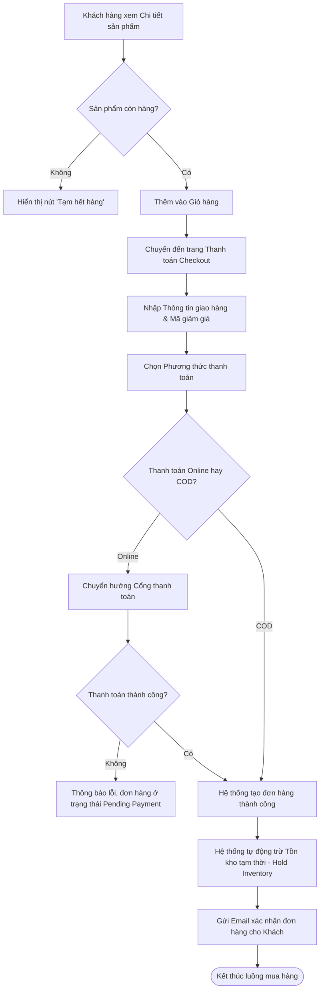
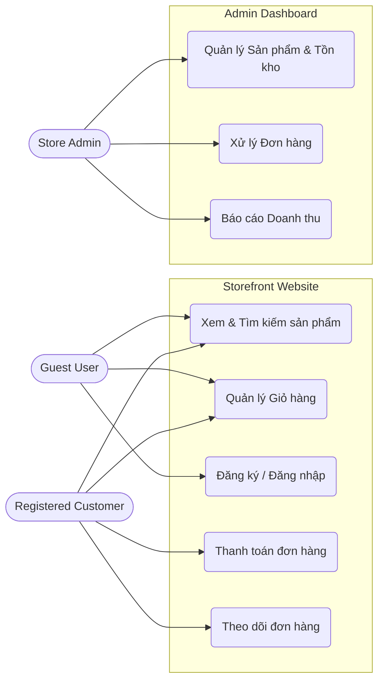

# Tài liệu Đặc tả Yêu cầu Phần mềm (Software Requirements Specification - SRS)

**Dự án:** Minh Aquarium Store
**Loại hệ thống:** Website E-commerce (B2C)
**Tác giả:** Nguyễn Duy Minh - Business Analyst
**Ngày lập:** 30/09/2026
**Phiên bản:** 1.0

---

## Phần 1: Tổng quan dự án (Project Overview)

### 1.1. Giới thiệu bài toán kinh doanh (Business Context)
Thị trường sinh vật cảnh (cá cảnh, tép cảnh, thủy sinh) đang ngày càng phát triển. Tuy nhiên, việc quản lý và kinh doanh trực tuyến các mặt hàng này gặp nhiều khó khăn đặc thù: yêu cầu khắt khe về điều kiện sống, vận chuyển nhanh chóng, và cần tư vấn chi tiết cho người chơi. Dự án **Minh Aquarium Store** được xây dựng nhằm cung cấp một nền tảng thương mại điện tử chuyên nghiệp, giải quyết bài toán quản lý bán hàng đa kênh, đồng thời mang đến trải nghiệm mua sắm thông minh, an tâm cho khách hàng đam mê thủy sinh.

### 1.2. Mục tiêu hệ thống (Business Objectives)
- Xây dựng kênh bán hàng trực tuyến chuyên nghiệp, gia tăng doanh số và mở rộng tệp khách hàng.
- Tối ưu hóa quy trình quản lý đơn hàng, theo dõi sát sao số lượng tồn kho của sinh vật sống và thiết bị.
- Nâng cao trải nghiệm người dùng thông qua việc cung cấp thông tin sản phẩm chi tiết và quy trình thanh toán mượt mà.

### 1.3. Phạm vi dự án (Scope)
**In-Scope:**
- Xây dựng Website Storefront dành cho Khách mua hàng.
- Xây dựng Admin Dashboard dành cho Quản trị viên quản lý kho, sản phẩm và đơn hàng.
- Tích hợp tính năng quản lý giỏ hàng, đặt hàng, và thanh toán (COD, Chuyển khoản, Ví điện tử).

**Out-of-Scope:**
- Không bao gồm việc phát triển ứng dụng di động (Mobile App iOS/Android).
- Không bao gồm tích hợp hệ thống ERP phức tạp hay quản lý nhân sự.
- Không bao gồm các tính năng đấu giá sản phẩm hay diễn đàn cộng đồng.

---

## Phần 2: Phân tích người dùng & Chân dung người dùng (User Personas & Actors)

### 2.1. Xác định & Định nghĩa Actors (Tác nhân)
Hệ thống Minh Aquarium Store tương tác với 4 nhóm tác nhân chính:

1. **Khách vãng lai (Guest User):** 
   - *Mô tả:* Người chưa đăng nhập, thường truy cập qua các công cụ tìm kiếm hoặc mạng xã hội.
   - *Hành vi:* Chỉ lướt xem hàng, tra cứu kiến thức/sản phẩm và có thể thêm hàng vào giỏ tạm.

2. **Khách hàng thân thiết (Registered Customer):**
   - *Mô tả:* Người chơi thủy sinh đã tạo và xác thực tài khoản.
   - *Hành vi:* Quản lý giỏ hàng, thực hiện quy trình đặt hàng và theo dõi đơn hàng.

3. **Nhân viên vận hành/Kho (Shop Staff / Inventory Staff):**
   - *Mô tả:* Nhân viên trực tiếp xử lý đơn hàng và theo dõi hàng hóa thực tế tại cửa hàng.
   - *Hành vi:* Tiếp nhận đơn hàng mới, kiểm tra tình trạng cá/cây trong bể, đóng gói và bàn giao cho shipper.

4. **Quản trị viên (Store Admin):**
   - *Mô tả:* Chủ cửa hàng hoặc Quản lý cấp cao.
   - *Hành vi:* Toàn quyền cấu hình sản phẩm, chính sách giá, voucher và báo cáo doanh thu.

### 2.2. Xây dựng User Personas (Chân dung người dùng)
Để thiết kế tính năng sát với nhu cầu thực tế, dưới đây là 2 chân dung người dùng tiêu biểu:

#### Persona 1: Khách hàng mua sắm (Newbie Aquarist)
- **Hồ sơ:** Sinh viên hoặc dân văn phòng, mới tập chơi thủy sinh.
- **Mục tiêu (Goals):** Tìm mua các loại phụ kiện cơ bản, tép/cá dễ nuôi. Cần thông tin thông số nước rõ ràng để đảm bảo môi trường sống tốt.
- **Nỗi đau (Pain points):** Thiếu kiến thức chọn lọc sinh vật; rất sợ rủi ro giao hàng chậm làm chết cá/cây.
- **Hành vi (Behaviors):** Đọc kỹ phần mô tả và yêu cầu môi trường sống. Ưu tiên chọn đơn vị giao hỏa tốc hoặc tìm kiếm sự đảm bảo từ cửa hàng.

#### Persona 2: Chủ Shop / Quản trị viên (Store Manager)
- **Hồ sơ:** Chủ cửa hàng Minh Aquarium, người điều hành kinh doanh và nhập nguồn hàng.
- **Mục tiêu (Goals):** Quản lý tồn kho linh hoạt, duyệt đơn nhanh và cập nhật mã vận đơn tức thì để theo dõi tiến độ giao nhận.
- **Nỗi đau (Pain points):** Tồn kho sinh vật sống có tỷ lệ hao hụt tự nhiên cao (cá chết, cây héo), nếu hệ thống không hỗ trợ trừ hao hụt linh hoạt sẽ dẫn đến bán vượt tồn kho thực tế.
- **Hành vi (Behaviors):** Thường xuyên truy cập Dashboard, cập nhật số lượng tồn kho liên tục và đồng bộ mã vận đơn ngay khi bàn giao cho shipper để khách hàng theo dõi.

### 2.3. Ma trận phân quyền (Role-Based Access Control - RBAC Matrix)
Bảng dưới đây mô tả quyền hạn theo mô hình **CRUD** (Create - Tạo, Read - Đọc, Update - Cập nhật, Delete - Xóa) của các Role đối với các module hệ thống. Ký hiệu **"-"** nghĩa là không có quyền.

| Module (Phân hệ) | Guest User | Registered Customer | Shop/Inventory Staff | Store Admin |
| :--- | :---: | :---: | :---: | :---: |
| **Xem sản phẩm (Catalog & Search)** | R | R | R | C, R, U, D |
| **Đặt hàng (Cart & Checkout)** | C, R, U (Giỏ tạm) | C, R, U, D | - | - |
| **Quản lý kho (Inventory & Products)** | - | - | R, U | C, R, U, D |
| **Quản lý tài chính / Đơn hàng** | - | R (Đơn cá nhân) | R, U | C, R, U, D |
| **Cấu hình tài khoản (Account/Profile)** | - | C, R, U | R, U | C, R, U, D |

---

## Phần 3: Danh sách tính năng theo phân hệ (Functional Requirements)

### 3.1. Phân hệ Storefront (Khách mua hàng)
1. **Quản lý tài khoản:**
   - Đăng ký tài khoản mới bằng Email/SĐT.
   - Đăng nhập, đăng xuất hệ thống.
   - Quên mật khẩu (Khôi phục qua Email OTP hoặc link).
2. **Xem & Tìm kiếm sản phẩm:**
   - Xem sản phẩm theo danh mục: *Sinh vật thủy sinh, Cây cảnh, Thiết bị/Phụ kiện.*
   - Tìm kiếm sản phẩm bằng từ khóa (Freetext search).
   - Lọc và sắp xếp sản phẩm theo: Khoảng giá, đánh giá (Rating), Mới nhất.
3. **Chi tiết sản phẩm & Quản lý Giỏ hàng:**
   - Xem thông tin chi tiết: Giá, hình ảnh, mô tả, thông số kỹ thuật (độ pH, nhiệt độ đối với sinh vật).
   - Thêm sản phẩm vào giỏ hàng, thay đổi số lượng, xóa sản phẩm.
   - Lưu trạng thái giỏ hàng (Save for later / Session based).
4. **Quy trình Thanh toán (Checkout):**
   - Nhập thông tin và địa chỉ giao hàng.
   - Chọn phương thức vận chuyển (Ví dụ: Giao hỏa tốc cho cá/cây, Giao tiêu chuẩn cho thiết bị).
   - Chọn phương thức thanh toán: COD, Chuyển khoản ngân hàng, Ví điện tử (Momo/ZaloPay).
   - Nhập và áp dụng mã giảm giá (Coupon/Promo Code).
5. **Theo dõi trạng thái đơn hàng (Tracking order):**
   - Xem danh sách đơn hàng đã đặt.
   - Theo dõi trạng thái: *Pending (Chờ xử lý) ➔ Processing (Đang xử lý) ➔ Delivering (Đang giao) ➔ Delivered (Đã giao) / Cancelled (Đã hủy).*

### 3.2. Phân hệ Admin Dashboard (Quản trị viên)
1. **Dashboard tổng quan:**
   - Xem biểu đồ doanh thu theo thời gian (Ngày/Tuần/Tháng).
   - Thống kê tổng số lượng đơn hàng, tỷ lệ chuyển đổi.
   - Hiển thị danh sách sản phẩm sắp hết hàng (Low stock alert).
2. **Quản lý sản phẩm & Danh mục:**
   - Thêm mới, sửa, xóa, ẩn/hiện danh mục (Categories).
   - Quản lý sản phẩm (CRUD): Tên, SKU, Hình ảnh, Giá bán, Giá nhập, Mô tả.
   - Cập nhật và quản lý số lượng tồn kho (Inventory).
3. **Quản lý đơn hàng:**
   - Xem danh sách toàn bộ đơn hàng của hệ thống.
   - Duyệt đơn hàng (Xác nhận và chuyển trạng thái sang Đang xử lý/Đang giao).
   - Cập nhật mã vận đơn (Tracking ID).
   - Hủy đơn hàng và bắt buộc ghi nhận lý do hủy (Hết hàng, Khách đổi ý,...).
4. **Quản lý khách hàng:**
   - Xem danh sách khách hàng đã đăng ký.
   - Xem chi tiết lịch sử mua hàng, tổng chi tiêu của từng khách hàng.

---

## Phần 4: Đặc tả Use Case chi tiết

### Use Case 1: Đặt hàng và Thanh toán (Checkout Flow)
- **Use Case ID:** UC01
- **Actor:** Customer (Khách hàng)
- **Pre-condition:** Khách hàng đã đăng nhập thành công và có ít nhất 1 sản phẩm trong giỏ hàng.
- **Post-condition:** Đơn hàng được tạo thành công trên hệ thống với trạng thái "Pending", số lượng tồn kho của sản phẩm bị trừ tạm thời (Hold Inventory), hệ thống gửi Email xác nhận.

**Main Flow (Luồng chính):**
1. Customer truy cập vào trang Giỏ hàng và nhấn nút "Tiến hành thanh toán".
2. Hệ thống hiển thị trang Checkout, yêu cầu Customer cung cấp thông tin giao hàng.
3. Customer chọn địa chỉ đã lưu hoặc nhập địa chỉ giao hàng mới.
4. Hệ thống tự động tính toán và hiển thị Phí vận chuyển dựa trên khu vực giao hàng.
5. Customer nhập mã giảm giá (Nếu có) và nhấn "Áp dụng". Hệ thống cập nhật lại Tổng tiền đơn hàng.
6. Customer chọn Phương thức thanh toán (Ví dụ: COD - Thanh toán khi nhận hàng).
7. Customer nhấn nút "Đặt hàng".
8. Hệ thống kiểm tra lại số lượng tồn kho của các sản phẩm trong giỏ.
9. Hệ thống lưu đơn hàng, tạo Order ID và hiển thị màn hình "Đặt hàng thành công".
10. Hệ thống gửi Email xác nhận chi tiết đơn hàng đến Customer.

**Alternative Flow (Luồng thay thế):**
- *Tại bước 6:* Nếu Customer chọn thanh toán qua Ví điện tử (Momo/VNPAY).
  - *Bước 7a:* Customer nhấn "Đặt hàng", hệ thống chuyển hướng sang trang thanh toán của Đối tác (Payment Gateway).
  - *Bước 8a:* Customer hoàn tất việc thanh toán trên trang của Đối tác.
  - *Bước 9a:* Hệ thống nhận kết quả trả về từ Đối tác, cập nhật trạng thái thanh toán là "Paid" và hiển thị màn hình "Đặt hàng thành công". Tiếp tục Bước 10.

**Exception Flow (Luồng ngoại lệ):**
- *Tại bước 5:* Mã giảm giá không hợp lệ, hết hạn, hoặc không đủ điều kiện áp dụng. Hệ thống hiển thị thông báo lỗi màu đỏ ngay dưới ô nhập mã, giữ nguyên Tổng tiền cũ. Customer có thể nhập lại hoặc bỏ qua.
- *Tại bước 8:* Một hoặc nhiều sản phẩm trong giỏ hàng vượt quá số lượng tồn kho hiện tại. Hệ thống thông báo lỗi "Sản phẩm X không đủ số lượng", đưa Customer trở lại trang Giỏ hàng để điều chỉnh.
- *Tại bước 9a (Alternative):* Thanh toán qua Cổng trực tuyến thất bại (Lỗi kết nối, số dư không đủ). Hệ thống hiển thị thông báo lỗi thanh toán, đơn hàng vẫn được tạo nhưng ở trạng thái "Pending Payment".

---

### Use Case 2: Xử lý và Cập nhật trạng thái đơn hàng (Order Processing)
- **Use Case ID:** UC02
- **Actor:** Admin
- **Pre-condition:** Admin đã đăng nhập vào Admin Dashboard. Có đơn hàng đang ở trạng thái "Pending".
- **Post-condition:** Trạng thái đơn hàng được cập nhật, tồn kho được trừ thực tế (hoặc hoàn lại nếu hủy), khách hàng nhận được thông báo cập nhật.

**Main Flow (Luồng chính):**
1. Admin truy cập module "Quản lý Đơn hàng" trên Dashboard.
2. Hệ thống hiển thị danh sách đơn hàng. Admin lọc các đơn hàng có trạng thái "Pending".
3. Admin chọn một Đơn hàng cụ thể để xem chi tiết.
4. Hệ thống hiển thị thông tin sản phẩm, số lượng, và địa chỉ nhận hàng của khách.
5. Admin kiểm tra hàng hóa trong kho, đóng gói thành công và nhấn "Xác nhận & Giao hàng".
6. Hệ thống yêu cầu Admin nhập "Mã vận đơn" (Tracking Code) và chọn "Đơn vị vận chuyển".
7. Admin nhập thông tin và nhấn "Lưu".
8. Hệ thống cập nhật trạng thái đơn hàng thành "Delivering" (Đang giao), trừ tồn kho thực tế (Deduct Inventory).
9. Hệ thống gửi Email thông báo "Đơn hàng đang được giao" kèm mã vận đơn cho Customer.

**Alternative Flow:**
- *Tại bước 5 (Hủy đơn hàng):* Admin phát hiện sản phẩm bị lỗi hỏng không thể giao, hoặc khách hàng gọi điện yêu cầu hủy.
  - *Bước 6a:* Admin nhấn nút "Hủy đơn hàng".
  - *Bước 7a:* Hệ thống hiển thị Popup yêu cầu chọn/nhập "Lý do hủy". Admin điền lý do và nhấn "Xác nhận".
  - *Bước 8a:* Hệ thống cập nhật trạng thái đơn hàng thành "Cancelled", hoàn lại số lượng tồn kho (Release Inventory).
  - *Bước 9a:* Hệ thống gửi Email thông báo đơn hàng đã bị hủy kèm lý do cho Customer.

---

## Phần 5: User Stories & Acceptance Criteria

**User Story 1: Chức năng Tìm kiếm Sản phẩm**
> **As a** Customer, **I want** to search for products using keywords, **so that** I can easily find specific fish or plants without navigating through all categories.

**Acceptance Criteria (Gherkin):**
- **Scenario 1: Keyword matches existing products**
  - **Given** the customer is on the Homepage
  - **When** the customer enters "Neon Tetra" into the search bar and clicks the Search icon
  - **Then** the system should navigate to the Search Results page
  - **And** display a list of all products containing "Neon Tetra" in their name or description.
- **Scenario 2: Keyword does not match any products**
  - **Given** the customer is on the Homepage
  - **When** the customer enters "Dragon" into the search bar and clicks the Search icon
  - **Then** the system should navigate to the Search Results page
  - **And** display a message "No products found for 'Dragon'"
  - **And** suggest related popular products.

**User Story 2: Chức năng Áp dụng Mã giảm giá**
> **As a** Customer, **I want** to apply a coupon code on the checkout page, **so that** I can get a discount on my total order amount.

**Acceptance Criteria (Gherkin):**
- **Scenario 1: Valid coupon code is applied**
  - **Given** the customer is on the Checkout page with valid items in the cart
  - **When** the customer enters an active coupon code "MINH10" and clicks "Apply"
  - **Then** the system should display a success message "Coupon applied successfully"
  - **And** deduct 10% from the total order amount.
- **Scenario 2: Invalid or expired coupon code is applied**
  - **Given** the customer is on the Checkout page
  - **When** the customer enters an expired coupon code "OLDCODE" and clicks "Apply"
  - **Then** the system should display an error message "This coupon is expired or invalid"
  - **And** the total order amount should remain unchanged.

**User Story 3: Chức năng Cảnh báo Tồn kho cho Admin**
> **As an** Admin, **I want** to see an alert on the Dashboard for products that are running low on stock, **so that** I can restock them in time before they run out.

**Acceptance Criteria (Gherkin):**
- **Scenario 1: Product stock falls below threshold**
  - **Given** the Admin is logged into the Admin Dashboard
  - **When** a product's available inventory drops below 5 units
  - **Then** the product name and its current quantity should be listed in the "Low Stock Alerts" widget on the main Dashboard
  - **And** the quantity number should be highlighted in Red color.

---

## Phần 6: Thiết kế mô hình dữ liệu (ERD - Database Specifications)

### 6.1. Entity Dictionary (Danh sách Bảng & Thuộc tính)

#### 1. Entity: `Users` (Người dùng/Khách hàng/Admin)
| Field | Data Type | PK/FK | Nullable | Description |
| :--- | :--- | :---: | :---: | :--- |
| user_id | INT | PK | No | ID tự tăng |
| role_id | INT | FK | No | Tham chiếu bảng Roles |
| full_name | VARCHAR(100)| | No | Họ và tên |
| email | VARCHAR(100)| | No | Unique email |
| password | VARCHAR(255)| | No | Mật khẩu (Hashed) |
| phone | VARCHAR(15) | | Yes | Số điện thoại |
| created_at | TIMESTAMP | | No | Ngày tạo tài khoản |

#### 2. Entity: `Roles` (Vai trò)
| Field | Data Type | PK/FK | Nullable | Description |
| :--- | :--- | :---: | :---: | :--- |
| role_id | INT | PK | No | ID tự tăng |
| role_name | VARCHAR(50) | | No | Tên quyền (Admin, Customer) |

#### 3. Entity: `Categories` (Danh mục sản phẩm)
| Field | Data Type | PK/FK | Nullable | Description |
| :--- | :--- | :---: | :---: | :--- |
| category_id | INT | PK | No | ID tự tăng |
| parent_id | INT | FK | Yes | Tham chiếu chính bảng Categories (Sub-category)|
| name | VARCHAR(100)| | No | Tên danh mục |
| description | TEXT | | Yes | Mô tả danh mục |

#### 4. Entity: `Products` (Sản phẩm)
| Field | Data Type | PK/FK | Nullable | Description |
| :--- | :--- | :---: | :---: | :--- |
| product_id | INT | PK | No | ID tự tăng |
| category_id | INT | FK | No | Tham chiếu Categories |
| sku | VARCHAR(50) | | No | Mã sản phẩm (Unique) |
| name | VARCHAR(255)| | No | Tên sản phẩm |
| price | DECIMAL(10,2)| | No | Giá bán |
| description | TEXT | | Yes | Mô tả chi tiết |
| image_url | VARCHAR(255)| | Yes | Link hình ảnh chính |

#### 5. Entity: `Inventory` (Tồn kho)
| Field | Data Type | PK/FK | Nullable | Description |
| :--- | :--- | :---: | :---: | :--- |
| inventory_id| INT | PK | No | ID tự tăng |
| product_id | INT | FK | No | Tham chiếu Products |
| qty_available| INT | | No | Số lượng có thể bán |
| qty_reserved| INT | | No | Số lượng đang bị giữ (trong đơn hàng Pending) |

#### 6. Entity: `Orders` (Đơn hàng)
| Field | Data Type | PK/FK | Nullable | Description |
| :--- | :--- | :---: | :---: | :--- |
| order_id | INT | PK | No | ID tự tăng |
| user_id | INT | FK | No | Tham chiếu Users |
| total_amount| DECIMAL(10,2)| | No | Tổng tiền thanh toán |
| status | VARCHAR(20) | | No | Pending, Processing, Delivering, Delivered, Cancelled |
| shipping_address| TEXT | | No | Địa chỉ giao hàng |
| created_at | TIMESTAMP | | No | Ngày tạo đơn |

#### 7. Entity: `OrderItems` (Chi tiết Đơn hàng)
| Field | Data Type | PK/FK | Nullable | Description |
| :--- | :--- | :---: | :---: | :--- |
| item_id | INT | PK | No | ID tự tăng |
| order_id | INT | FK | No | Tham chiếu Orders |
| product_id | INT | FK | No | Tham chiếu Products |
| quantity | INT | | No | Số lượng mua |
| unit_price | DECIMAL(10,2)| | No | Đơn giá tại thời điểm mua |

#### 8. Entity: `Payments` (Thanh toán)
| Field | Data Type | PK/FK | Nullable | Description |
| :--- | :--- | :---: | :---: | :--- |
| payment_id | INT | PK | No | ID tự tăng |
| order_id | INT | FK | No | Tham chiếu Orders |
| method | VARCHAR(50) | | No | COD, Bank Transfer, Momo |
| status | VARCHAR(20) | | No | Pending, Paid, Failed, Refunded |
| transaction_id| VARCHAR(100)| | Yes | Mã giao dịch từ cổng thanh toán |

### 6.2. Mối quan hệ giữa các bảng (Relationships)
- **Roles (1) ➔ (N) Users:** Một Role áp dụng cho nhiều User.
- **Categories (1) ➔ (N) Products:** Một Danh mục chứa nhiều Sản phẩm.
- **Products (1) ➔ (1) Inventory:** Mỗi Sản phẩm có một bản ghi Tồn kho tương ứng.
- **Users (1) ➔ (N) Orders:** Một Khách hàng có thể đặt nhiều Đơn hàng.
- **Orders (1) ➔ (N) OrderItems:** Một Đơn hàng bao gồm nhiều Sản phẩm (Chi tiết đơn hàng).
- **Products (1) ➔ (N) OrderItems:** Một Sản phẩm có thể xuất hiện trong nhiều Đơn hàng khác nhau.
- **Orders (1) ➔ (1) Payments:** Mỗi Đơn hàng liên kết với một Giao dịch Thanh toán.

---

## Phần 7: Thiết kế Sơ đồ & Đặc tả Giao diện (Diagrams & Wireframe Specs)

### 7.1. Mã sơ đồ Mermaid

#### A. Sơ đồ Activity Diagram (Luồng mua hàng & Trừ tồn kho)
Sơ đồ thể hiện luồng nghiệp vụ khi khách hàng chọn mua sinh vật cảnh, thanh toán và hệ thống xử lý tồn kho.

#### B. Sơ đồ Use Case Diagram (Tổng thể hệ thống)
Sơ đồ mô tả các chức năng chính (Use Cases) tương tác với các Actors.

### 7.2. Đặc tả Wireframe (UI Layout & Field Specifications)

#### Màn hình 1: Trang Chi tiết sản phẩm (Product Detail Page)
*Mục đích:* Cung cấp thông tin đầy đủ, đặc biệt cho các mặt hàng sinh vật sống, giúp khách hàng yên tâm khi chọn mua.

**Bố cục (Layout):**
- **Trái:** Carousel hình ảnh/video sản phẩm (cá/tép/cây thực tế).
- **Phải:** Thông tin mua hàng và Nút hành động.
- **Dưới:** Tabs thông tin (Mô tả chi tiết, Thông số kỹ thuật môi trường, Hướng dẫn chăm sóc, Đánh giá/Review).

**Đặc tả trường dữ liệu (Field Specs):**
1. `Product Name` (Text, H1): Tên sinh vật (VD: Cá Neon Tetra).
2. `Price` (Currency): Giá niêm yết và Giá khuyến mãi (hiển thị màu đỏ, font to).
3. `Stock Status` (Badge): 
   - Nếu `qty > 0`: "Còn hàng (x sản phẩm)".
   - Nếu `qty == 0`: "Tạm hết hàng".
4. `Aquarium Requirements` (Box thông số quan trọng cho sinh vật):
   - **Kích thước bể tối thiểu:** Text (VD: 40 Lít).
   - **Nhiệt độ (Temperature):** Range (VD: 22°C - 28°C).
   - **Độ pH khuyến nghị:** Range (VD: 6.0 - 7.5).
   - **Mức độ chăm sóc:** Dropdown/Badge (Dễ / Trung bình / Khó).
5. `Quantity Selector` (Input Number): Default = 1, Min = 1, Max = Available Stock.
6. `Add to Cart` (Button): Nút Primary, vô hiệu hóa (disabled) nếu Stock = 0.

#### Màn hình 2: Màn hình Checkout & Thanh toán
*Mục đích:* Thu thập thông tin giao hàng chính xác, cung cấp quy trình thanh toán minh bạch.

**Bố cục (Layout):**
- **Trái (Cột 70%):** Form thông tin người nhận, Chọn đơn vị vận chuyển, Phương thức thanh toán.
- **Phải (Cột 30%):** Order Summary (Tóm tắt đơn hàng), Ô nhập Mã giảm giá, Tổng tiền thanh toán.

**Đặc tả trường dữ liệu (Field Specs & Validation Rules):**
1. `Họ và tên` (Text Input): Mandatory (Bắt buộc). Tối thiểu 2 ký tự.
2. `Số điện thoại` (Text Input): Mandatory. Validation regex: `/^(0|\+84)[3|5|7|8|9][0-9]{8}$/` (Bắt buộc đúng định dạng mạng di động Việt Nam).
3. `Địa chỉ giao hàng` (3 Cascading Dropdowns): 
   - Tỉnh/Thành phố (Mandatory).
   - Quận/Huyện (Mandatory, filter theo Tỉnh/Thành).
   - Phường/Xã (Mandatory, filter theo Quận/Huyện).
4. `Địa chỉ chi tiết` (Text Input): Mandatory. Ghi chú số nhà, tên đường.
5. `Phương thức vận chuyển` (Radio Buttons): 
   - "Giao hỏa tốc" - Phí ship tính theo km. Khuyến nghị bắt buộc nếu có sinh vật sống.
   - "Giao tiêu chuẩn" - Phí ship đồng giá.
6. `Phương thức thanh toán` (Radio Buttons): COD / Chuyển khoản ngân hàng / Ví điện tử Momo/VNPAY.
7. `Nút Đặt hàng` (Button Primary): Chỉ click được (Enabled) khi toàn bộ form phía trên valid. Khi click hiển thị loading icon chặn double-click.

### 7.3. Quy tắc nghiệp vụ đặc thù (Business Rules)

Hệ thống Minh Aquarium Store tuân thủ các quy tắc nghiệp vụ sau để tối ưu vận hành và bảo vệ sinh vật sống:

1. **BR01 - Quy tắc giữ hàng trong giỏ (Cart Inventory Hold):**
   - Việc khách hàng thêm sản phẩm vào Giỏ hàng *không làm trừ tồn kho* của sản phẩm đó.
   - Tồn kho chỉ bị trừ tạm thời (Hold) ngay khi khách hàng nhấn nút **"Đặt hàng"** (tức là tạo mã đơn thành công).
   - Nếu thanh toán Online: Thời gian giữ tồn kho là 15 phút. Quá 15 phút không thanh toán, hệ thống tự động hủy đơn và hoàn (release) tồn kho.

2. **BR02 - Logic tính phí ship & Vận chuyển Sinh vật sống (Live Livestock Rule):**
   - Nếu Giỏ hàng có chứa ít nhất 1 sản phẩm thuộc danh mục "Sinh vật sống" (Cá, tép, ốc, thực vật nhạy cảm), hệ thống sẽ **ẩn/vô hiệu hóa** phương thức "Giao tiêu chuẩn" (do thời gian giao mất 1-3 ngày làm chết sinh vật).
   - Khách hàng bắt buộc phải chọn "Giao hỏa tốc" (giao nội thành) hoặc "Gửi xe khách" (đi tỉnh) với mức phí ship được cấu hình riêng theo trọng lượng nước đóng gói.

3. **BR03 - Chính sách bảo hành & Bù hao hụt khi vận chuyển (DOA - Dead On Arrival Policy):**
   - Hệ thống hỗ trợ Admin tạo "Đơn hàng bù" không tính giá trị sản phẩm và không phí ship đối với trường hợp sinh vật chết lúc nhận hàng.
   - Điều kiện: Khách hàng phải có video unboxing không cắt ghép và gửi khiếu nại về hệ thống/hotline trong vòng **2 giờ** kể từ lúc shipper cập nhật trạng thái "Giao hàng thành công". Admin có quyền ấn "Duyệt bù hao hụt" trực tiếp từ trang chi tiết đơn hàng cũ.
